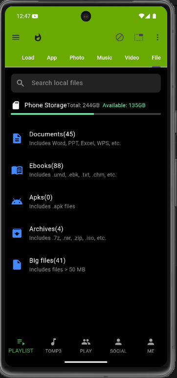
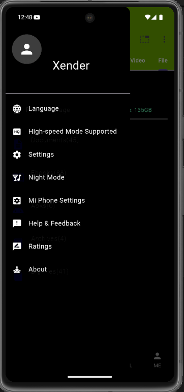

# 📱 Mobile Application Lab Exam

**Name:** Mehedi Hasan Hridoy  
**ID:** 221-15-5097  
**Section:** 61_B1  

---

## 🧪 Lab Exam Overview

This project was developed as part of the **Mobile Application Development Lab Exam**. The output of the application is demonstrated using the screenshots below.

---

## ✅ Application Output

### 🖼️ Screen 1



---

### 🖼️ Screen 2



---

## 📁 Assets Used

The following image assets were included in the `pubspec.yaml` file:

```yaml
assets:
  - assets/screen1.png
  - assets/screen2.png
